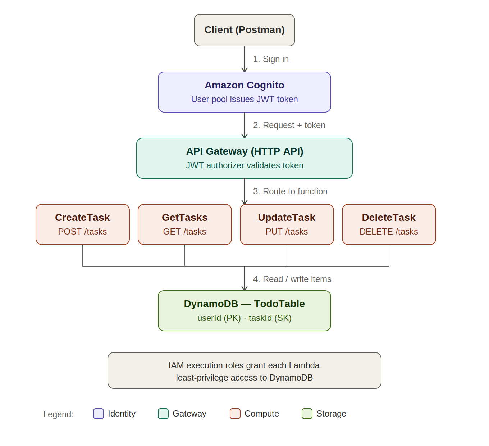

# Serverless REST API with Cognito Auth, DynamoDB & API Gateway

AWS Solutions Architect – Associate graduation project.

A fully serverless REST API for a to-do list application. Users authenticate through Amazon Cognito, receive a JWT token, and use that token to create, read, update, and delete their own tasks. The API is built entirely on managed AWS services — no servers to patch or scale.

## Architecture



**Request flow:**
1. The client signs in to an Amazon Cognito user pool and receives a JWT access token.
2. The client calls the API with the token in the `Authorization: Bearer <token>` header.
3. API Gateway's JWT authorizer validates the token against Cognito before allowing the request through.
4. API Gateway routes the request to the matching Lambda function based on the HTTP method.
5. The Lambda function reads or writes items in the DynamoDB table and returns a response.

## AWS services used

| Service | Role |
|---|---|
| Amazon Cognito | User pool for sign-up/sign-in; issues JWT tokens |
| API Gateway (HTTP API) | Public entry point; JWT authorizer protects every route |
| AWS Lambda | Four functions handling CRUD logic (Python 3.13) |
| Amazon DynamoDB | NoSQL table storing tasks |
| IAM | Least-privilege execution roles for each Lambda function |
| AWS X-Ray | Active tracing on each Lambda function for request-level observability |

## Data model

**Table:** `TodoTable`

| Attribute | Type | Role |
|---|---|---|
| `userId` | String | Partition key |
| `taskId` | String | Sort key (UUID, generated on create) |
| `title` | String | Task description |
| `status` | String | `pending` or `completed` |

Using `userId` as the partition key groups every task belonging to one user together, and `taskId` uniquely identifies each task within that group. This lets `GetTasks` fetch all of a user's tasks in a single, efficient query.

## API routes

All routes require a valid Cognito JWT in the `Authorization` header. Unauthenticated requests receive `401 Unauthorized`.

| Method | Route | Lambda | Description |
|---|---|---|---|
| POST | `/tasks` | `CreateTask` | Create a new task |
| GET | `/tasks?userId={id}` | `GetTasks` | List all tasks for a user |
| PUT | `/tasks` | `UpdateTask` | Update a task's status |
| DELETE | `/tasks` | `DeleteTask` | Delete a task |

### Request / response examples

**Create a task**
```
POST /tasks
Authorization: Bearer <token>

{
  "userId": "user1",
  "title": "Learn AWS API Gateway"
}
```
```json
{
  "message": "Task created successfully",
  "taskId": "b7741b41-4a52-444b-96e9-cf0b6fbecfa1"
}
```

**Get tasks**
```
GET /tasks?userId=user1
Authorization: Bearer <token>
```
```json
{
  "tasks": [
    {
      "userId": "user1",
      "taskId": "b7741b41-4a52-444b-96e9-cf0b6fbecfa1",
      "title": "Learn AWS API Gateway",
      "status": "pending"
    }
  ],
  "count": 1
}
```

**Update a task**
```
PUT /tasks
Authorization: Bearer <token>

{
  "userId": "user1",
  "taskId": "b7741b41-4a52-444b-96e9-cf0b6fbecfa1",
  "status": "completed"
}
```

**Delete a task**
```
DELETE /tasks
Authorization: Bearer <token>

{
  "userId": "user1",
  "taskId": "b7741b41-4a52-444b-96e9-cf0b6fbecfa1"
}
```

## Lambda function code

Source for all four functions is in [`lambda_functions/`](lambda_functions):

- [`create_task.py`](lambda_functions/create_task.py)
- [`get_tasks.py`](lambda_functions/get_tasks.py)
- [`update_task.py`](lambda_functions/update_task.py)
- [`delete_task.py`](lambda_functions/delete_task.py)

Each function uses `boto3` to talk to DynamoDB and returns a JSON response with an appropriate HTTP status code.

## Security

- **Authentication**: Amazon Cognito user pool with email-based sign-in and self-registration enabled.
- **Authorization**: API Gateway JWT authorizer validates the token's issuer and audience on every request before it reaches any Lambda function. Requests without a valid token are rejected with `401 Unauthorized`.
- **Least privilege**: Each Lambda function has its own IAM execution role scoped to DynamoDB access, following the principle of least privilege recommended by the AWS Well-Architected Framework.

## Observability

Active tracing (AWS X-Ray) is enabled on all four Lambda functions. Every invocation is traced end-to-end, and the resulting service map (verified in the X-Ray console) shows the request path from client through each Lambda function's context and execution. This surfaces per-invocation latency and errors without any custom instrumentation.

## Architectural decisions: HTTP API vs REST API

This project uses API Gateway **HTTP API** rather than **REST API**. HTTP API was chosen deliberately for its lower cost, lower latency, and simpler native JWT authorizer integration with Cognito, which maps directly onto this project's requirements.

That choice comes with a trade-off worth documenting explicitly, since it affects which of the "Key AWS Services" listed in the original project brief could be implemented:

| Feature | Supported on HTTP API? | Notes |
|---|---|---|
| JWT authorizer (Cognito) | Yes | Native, first-class support — used throughout this project |
| AWS X-Ray active tracing on API Gateway itself | **No** | AWS X-Ray active tracing at the API Gateway layer is a REST-API-only feature. Mitigated here by enabling X-Ray directly on each Lambda function instead, which still provides real, verified request tracing. |
| API Gateway response caching | **No** | Caching is a REST-API-only feature; there is no HTTP API equivalent from the console or API. |
| AWS WAF | **No** | WAF web ACLs can only be associated with REST APIs (and ALB, AppSync, Cognito, App Runner, Verified Access) — HTTP API is not a supported resource type for WAF association, confirmed via both the current and classic WAF consoles. |

These three limitations were confirmed hands-on while building this project, not assumed from documentation alone. Rebuilding the API on REST API would unlock all three, at the cost of higher per-request pricing, no native JWT authorizer (requiring a custom Lambda authorizer instead), and a significantly larger integration surface to build and test. For an API of this scope, that trade-off was judged not worth making — but it is the natural next step if this project were extended (see below).

## How this was built and tested

1. Created the `TodoTable` DynamoDB table with `userId` (partition key) and `taskId` (sort key).
2. Wrote and deployed four Lambda functions, each granted DynamoDB access via an IAM execution role.
3. Tested each function individually using Lambda's built-in test events.
4. Created an HTTP API in API Gateway with four routes (`POST`, `GET`, `PUT`, `DELETE` on `/tasks`), each integrated with its corresponding Lambda function.
5. Verified the unprotected API end-to-end using Postman.
6. Created a Cognito user pool and a public app client (no client secret, so the token exchange works from a CLI or SPA without a backend).
7. Attached a JWT authorizer backed by the Cognito user pool to all four routes.
8. Confirmed requests without a token are rejected with `401 Unauthorized`.
9. Created a test user, authenticated via the AWS CLI (`aws cognito-idp initiate-auth`) to obtain a JWT, and used it in Postman's Bearer Token authorization to confirm authenticated requests succeed.
10. Enabled AWS X-Ray active tracing on all four Lambda functions and verified traces in the X-Ray service map after making live requests.

## Possible future enhancements

- Derive `userId` from the verified JWT claims server-side instead of trusting the client-supplied value in the request body.
- Migrate to API Gateway REST API to unlock AWS WAF, response caching, and native API-Gateway-level X-Ray tracing (see trade-off discussion above).
- Host a simple static frontend (S3 + CloudFront) that calls this API.
- Add DynamoDB Streams to trigger downstream processing (e.g. notifications) when a task is created or completed.

## Author

Built by **Ameen Komila** as a graduation project for the AWS Solutions Architect – Associate (SAA-C03) course.

Project idea based on "Project 3: Serverless REST API with Cognito Auth, DynamoDB & WAF" from the AWS SAA-C03 graduation project list by Ayman Aly Mahmoud.
