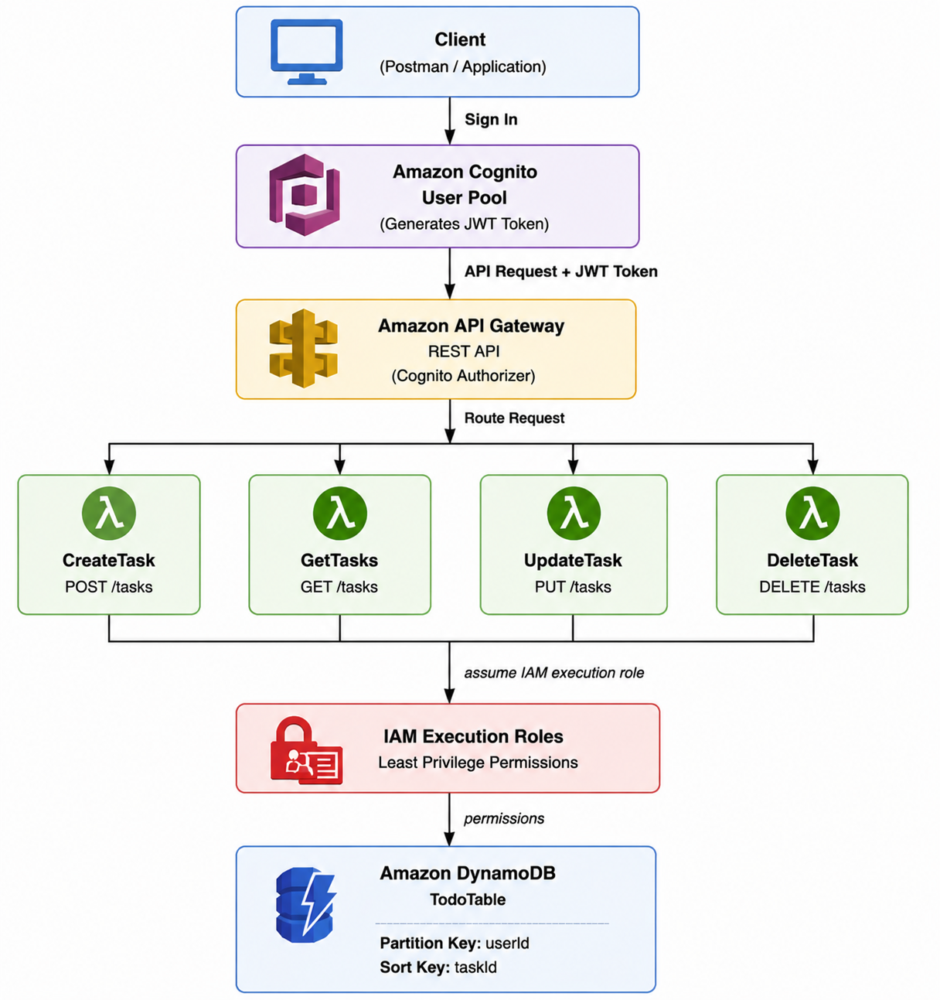

# Serverless Todo API on AWS

A secure serverless Todo API built using AWS managed services.

The project implements a complete CRUD backend with authentication, authorization, and persistent storage.

---

## Architecture Diagram



---

## Project Overview

This project demonstrates how to build a serverless REST API using AWS services.

Users authenticate through Amazon Cognito and receive a JWT token.  
The token is validated by API Gateway before allowing access to protected API endpoints.

The request is then routed to AWS Lambda functions that perform CRUD operations on DynamoDB.

---

## AWS Services Used

### Amazon Cognito
- User authentication
- User pool management
- JWT token generation
- Secure API access

### Amazon API Gateway
- REST API endpoints
- Cognito JWT authorization
- Request routing

### AWS Lambda
Four Lambda functions handle Todo operations:

| Function | Method | Endpoint | Description |
|---|---|---|---|
| CreateTask | POST | `/tasks` | Create a new task |
| GetTasks | GET | `/tasks` | Retrieve user tasks |
| UpdateTask | PUT | `/tasks` | Update task status |
| DeleteTask | DELETE | `/tasks` | Delete a task |

### Amazon DynamoDB

Database table:

```
TodoTable
```

Primary Key Design:

```
Partition Key: userId
Sort Key: taskId
```

Each user can only access their own tasks.

---

## Authentication Flow

1. User signs in using Amazon Cognito.
2. Cognito generates a JWT token.
3. Client sends API requests with the JWT token.
4. API Gateway validates the token.
5. Authorized requests are forwarded to Lambda.
6. Lambda reads or writes data in DynamoDB.

---

## API Endpoints

### Create Task

```
POST /tasks
```

Request body:

```json
{
    "title": "Learn AWS Serverless"
}
```

Response:

```json
{
    "message": "Task created successfully",
    "taskId": "task-id"
}
```

---

### Get Tasks

```
GET /tasks
```

Response:

```json
{
    "tasks": [],
    "count": 0
}
```

---

### Update Task

```
PUT /tasks
```

Request body:

```json
{
    "taskId": "task-id",
    "status": "completed"
}
```

---

### Delete Task

```
DELETE /tasks
```

Request body:

```json
{
    "taskId": "task-id"
}
```

---

## Security

The project follows AWS security best practices:

- Cognito authentication required for all API methods
- JWT token validation through API Gateway
- User isolation using `userId`
- IAM least privilege permissions
- No public database access

---

## Technologies

- Python
- AWS Lambda
- Amazon API Gateway
- Amazon Cognito
- Amazon DynamoDB
- AWS IAM
- AWS CloudShell

---

## Testing

The API was tested using AWS CloudShell.

Tested operations:

✅ User authentication  
✅ Create task  
✅ Retrieve tasks  
✅ Update task  
✅ Delete task  

---

## Project Structure

```
Serverless-Todo-API/

│
├── Lambda Functions/
│
├── CreateTask/
│   └── lambda_function.py
│
├── GetTasks/
│   └── lambda_function.py
│
├── UpdateTask/
│   └── lambda_function.py
│
├── DeleteTask/
│   └── lambda_function.py
│
├── aws-todo-architecture.png
│
└── README.md
```

---

## Author

Serverless Todo API Project

Built with AWS Serverless Architecture.
